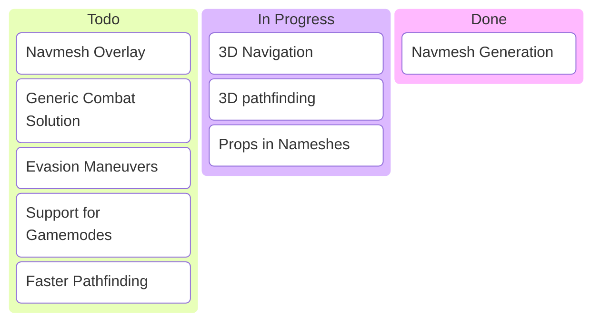

# bp-ort
(bots plugin or other)

the main feature of this plugin is ofc the bots.
Other features that this plugin offers
- auto mp_box loading
- disabling the limit on players in sp maybe?
- bringing back a less extensive version of r_drawworld
- name uwufication
- **server-side name overrides**
- "other testing functionality"
- admin abuse

pls refrain from downloading this mod if you don't know how, it's under active development and I don't have lot's of time to waste.

you can contact me tho at:
- [northstar discord](https://northstar.tf/discord) (as @cat_or_not)
- me@catornot.net
- [discussions](https://github.com/catornot/bp-ort/discussions)

# Ongoing Rewrite
this is like actual rewrite but it kind of is
old systems are left intack but are instead kind of put of EOL which in this could mean they can get removed at any point.
this "EOL" tag doesn't include any squirrel apis and admin abuse

most importantly it will bring better navigation and combat capabilities for bots (like wallrunning)

due to unforseen obstables the rewrite is not coming by the end of 2025, currently looking to getting it done by march 2026

## current sq api

### bots

- `void function BotSetTitan(entity bot, string titan)` sets the titan type for the bot
- `void function BotSetTargetPos(entity bot, vector target)` sets a goal for goal follower ai to follow
- `void function BotSetSimulationType(entity bot, int sim_type)` sets the bot index for a bot (doesn't work when called rigth after a bot is spawned)
- `entity ornull function BotSpawn(string bot_name)` spawns a bot with a name or if it is passed with "" the name is chosen randomly
- `void function AddBotName(string bot_name)` adds a bot name to the random name list
- `void function ClearBotNames()` removes all bot names from the random name list (scary!)

### navigation

- `var ornull function NavigationCreate(int hull)`
- `void function NavigationFindPath(var nav, vector start, vector end)`
- `array<vector> function NavigationGetAllPoints(var nav)`
- `vector ornull function NavigationNextPoint(var nav)`

**Code Callback** - the plugin attemps to call the following functions when the player connects which are not defined anywhere (aka you can define them)

- `string function CodeCallBack_CanChangeName(string uid, string name)`
- `string function CodeCallBack_CanChangeClangTag(string uid, string clan_tag)`

### name overides

- `void function RememberNameOverride(entity player, string name, string clan_tag )`

the plugin stores a name and clan tag for a player internally and will set them for the player on their next connection attempt

- `void function RememberNameOverrideUid(string uid, string name, string clan_tag )`

## bots 

### bot names
so bots have "unique" names derived from contributors to northstar to make bot puns (some are just "legacy names")

if you have a good name idea you can make a pull request or message me on discord about it

bot names can also be provided to the command that spawns the bots

### bot ai

the two most useful ones would be simply standing still (0) (for testing stuff) or the combat ai (6)

the combat ai is currently very not very smart since it just chases the closest enemy and tries to kill them

### important convars for bots

- `bot_cmds_type <index:int>`
controls which behavior is the default for the bots

- `bot_clang_tag <tag:string>`
the clan tag the bots get on spawn (default is BOT) 

### most imporant command

- `bot_spawn <name:int> <team:int> <ai:int>`
spawns a bot with a given name team or [ai index](https://github.com/catornot/bp-ort?tab=readme-ov-file#all-the-ai-indices)

other ones are found under `bot_` namespace (they are not so important)

### all the ai indices
- 0 => stand still
- 1 => crouch rapidly
- 2 => walk around mp_box
- 3 => chase player0
- 4 => shoot at closest enemy
- 5 => shoot at closest enemy + walk to them
- 6 => "combat ai"
- 7 => goal follower assigned from scripts
- 8 => headhunter ai
- 9 => ctf ai
- 10 => amped hardpoint ai (reqires navmesh)
- 11 => reserved
- 12 => slow crouching 
- 13 => follows farthest player 
- 14 => follows closest player  
- 15 => smth silly idk #1 
- 16 => smth silly idk #2 
- 17 => view debugger
- 18 => battery yoinker
- 19 => simply embarks into their titan
- 20 => failed slide hopping
- 21 => peaceful goal follower
- 22 => clear goal
- 23 => look at goal
- 30 => use offhand ability 0
- 31 => use offhand ability 1
- 32 => use offhand ability 2
- 33 => use offhand ability 3
- 34 => use offhand ability 4
- 100 => experimental wallrunning ai

6, 7, 8, 9, 10, 11, 13, 14, 19, and 21 require navmesh to be present on the map otherwise the game will crash (all of the standart mp maps have navmeshes)

### comments on "combat ai" and it's derivatives
it's a general purpose routine for the bots to follow.
it's just shoot anything or walk to the closest enemy.
it does support all facets of titanfall 2 gameplay (titan calling, embarking titans, using titans, pilot combat, etc) but it's very basic.
it also has a feature to actually make them a bit fair where they will get more aim spread the faster the target moves (only for pilots).
the derivations like the headhunter ai try to play the objective of the gamemode ~~but they are not auto activated and have to be manually set via the `bot_cmds_type` cvar~~
auto activation is controlled is controlled by `auto_select_gamemode` in the mod.

like the one before it but it now accepts a uid so that it can be set before anyone joins

btw the cvar `bot_uwufy` controls if connecting players will get their name uwufied (it's disabled by default now)

# BotExtras
this a optinal but recommend to have script mod for this plugin. it adds extra features on top of the plugin that are simply easier to implement in scripts.

it's most critical feature is notifying the plugin of the current selected titan for the bot and swapping loadout for bots. it also adds mod settings integration for bp_ort.
