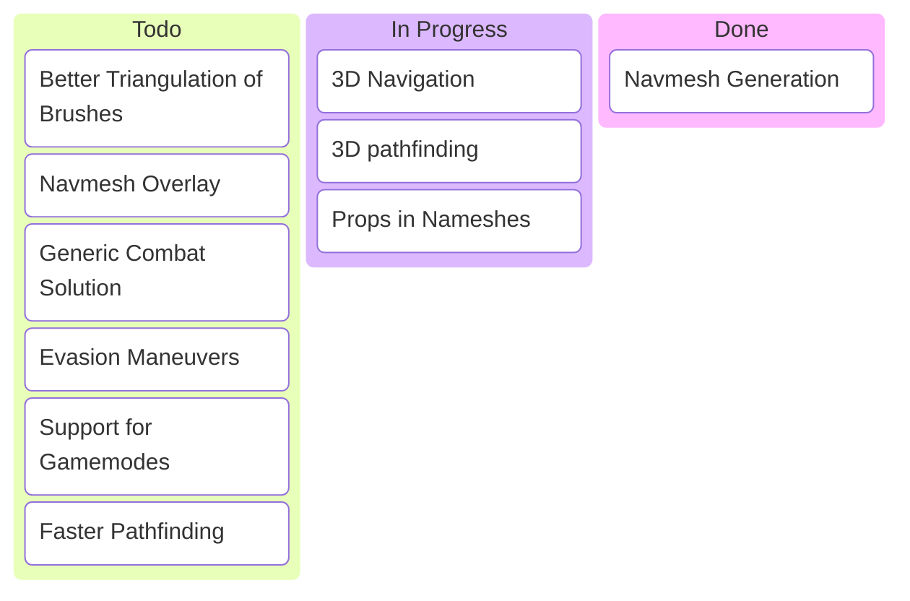

# bp-ort
(bots plugin or other)

the main feature of this plugin is ofc the bots.
Other features that this plugin offers
- serialized_io
- **server-side name overrides**
- admin abuse
- bringing back a less extensive version of r_drawworld
- "other testing functionality"

you can contact me at:
- [northstar discord](https://northstar.tf/discord) (as @cat_or_not)
- [#bp-ort:matrix.catornot.net](https://matrix.to/#/#bp-ort:matrix.catornot.net)
- me@catornot.net
  - probably no replies due to how I setup it tho lol
- [discussions](https://github.com/catornot/bp-ort/discussions)

# Ongoing Rewrite
the bots are getting re written from scratch in a new plugin that works in tandem with bp_ort.
This new plugin will bring better navigation and combat capabilities for bots (like wallrunning).
Due to unforeseen obstacles the rewrite is taking longer than expected currently looking to getting it done by end of summer 2026

```mermaid
kanban
  todo[Todo]    
    Navmesh[Better Triangulation of Brushes]
    navmeshv2[Navmesh Overlay]
    generic[Generic Combat Solution]
    evasion[Evasion Maneuvers]
    gamemodes[Support for Gamemodes]
    fasterpathfinding[Faster Pathfinding]
  progress[In Progress]
    navigation[3D Navigation]
    pathfinding[3D pathfinding]
    props[Props in Nameshes]
  Done[Done]
    Navmesh[Navmesh Generation]
```

